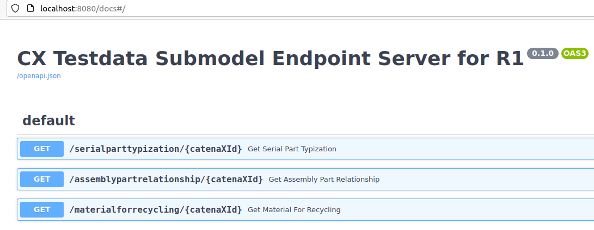

# Intro
This is a simple `importer.py` script to import from provided test data set.

The `main.py` server provides the data via standardized aspect / submodel endpoints.

This project is a simple test tool in the context of:

https://github.com/catenax-ng/product-data-integrity-demonstrator

# Settings
`.env-example` shows possible settings for `.env` / environment variables.

It contains default configuration for getting started with the getting-started-guide:

https://catenax-ng.github.io/docs/catenax-at-home-getting-started-guide


# Run
```
docker-compose up --build
```

Leave out `--build` to reuse the existing container/image.

Swagger API:s
http://localhost:8080/docs#/



# Configuration
`.env-example` is an example for the `.env` environment file that is required. It is used for docker-compose and also used inside the container to provide configuration to the server, e.g. `client_id` and `client_secret` to access the registry.

# Data Import
Connect to the running container:
```
docker-compose exec testdata2edc /bin/bash
```
You can then import or delete data with the following commands:
**(Change your Testdata BPN...)**
```
python importer.py --import-for BPNLTIERBZZ /testdata/<testdata_filename>.json
# delete items
python importer.py --import-for BPNLTIERBZZ --delete /testdata/<testdata_filename>.json
```

By default the project directory `testdata` is mounted to `/testdata` inside the container. Save your testdata file in this mounted directory.

You can find testdata files from internal sources at e.g.: https://confluence.catena-x.net/display/PL/BoMAsBuilt+test+dataset#BoMAsBuilttestdataset-5TestDataFiles

After the import, you can use the Submodel Endpoints with the `cx_id` as input. Try it at:
http://localhost:8080/docs#/

# Development
## Setup
You may use a virtual python env
```
python3 -m venv venv
source ./venv/bin/activate
```
Install the dependencies
```
pip install -r requirements.txt
```

## Run the endpoints
After the data has been imported, it can be served via the endpoints. Start the server with:
```
python main.py
```


# Todo / Notes
- Instead of importer script, think about upload interface


## Fetch data
```
./cli.py search all # Print the first 10 or so items from the registry
# to specify another file with environment variables, eg. client_id / client_secret you can run:
ENV_FILE=.env.INT ./cli.py search all # Print the first 10 or so items from the registry
# or export for the terminal session
export ENV_FILE=.env.INT

```
